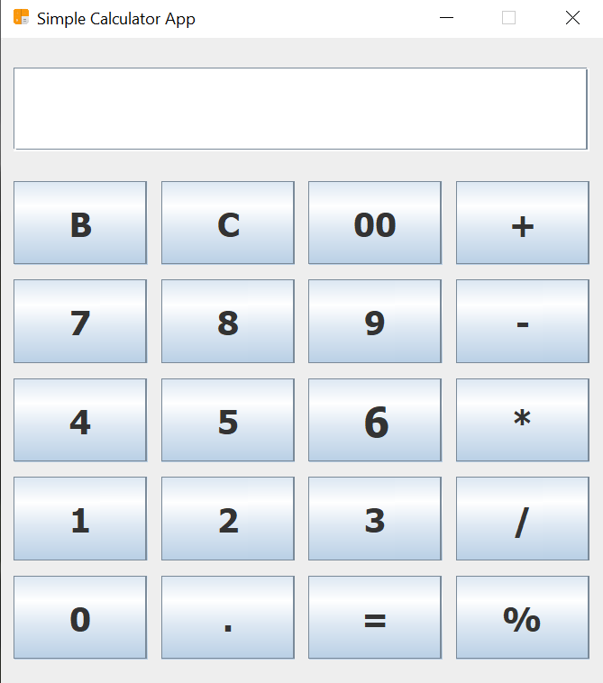
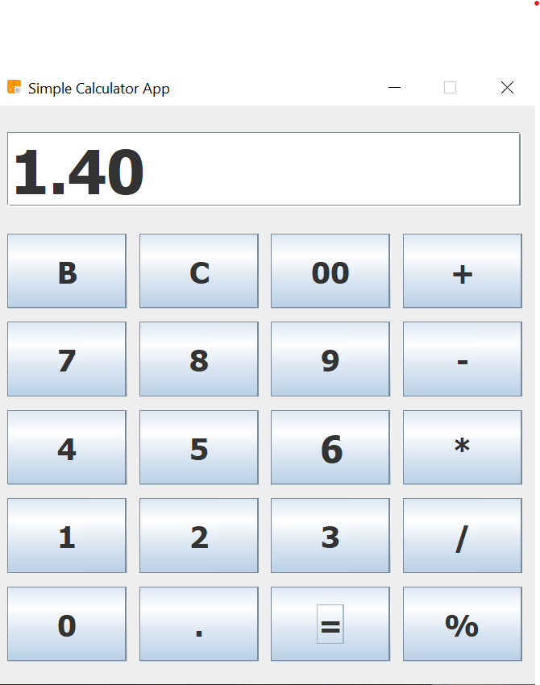

# Swing Java Calculator App

## Description
This is a simple calculator application developed using Java Swing. It provides basic arithmetic operations such as addition, subtraction, multiplication, and division. The user can interact with the calculator through a user-friendly graphical interface.

## Features
- Addition, subtraction, multiplication, and division operations supported.
- Clear button to reset the calculator display.
- Error handling for division by zero and invalid input.

## How to Run
1. Install Java on your system (JRE or JDK).
2. Download the `CalculatorApp.jar` file from the [Releases](https://github.com/Ajmal112/Swing_Java_Calculator_App/releases) section.
3. Double-click the `CalculatorApp.jar` file or run the following command in the terminal/command prompt:

## Screenshots

### Calculator App

## Contributing
Contributions are welcome! If you want to add new features, fix bugs, or improve the app, feel free to submit a pull request. Please follow the [CONTRIBUTING.md](./CONTRIBUTING.md) guidelines.

## License
This project is licensed under the [MIT License](./LICENSE).

## Author
- Your Name
- Email: your.email@example.com
- GitHub: [yourusername](https://github.com/Ajmal112/)

## Acknowledgments
Special thanks to [Eclipse][Swing].

